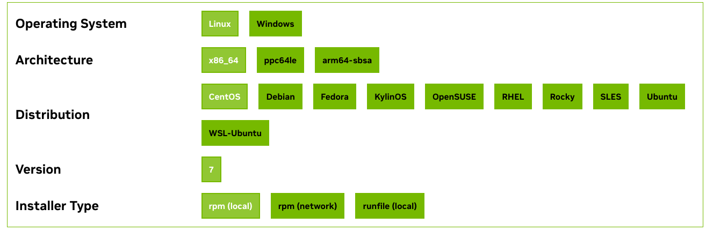

# FICS Cluster Q&A

## How to update CUDA Driver？

目前(2024/10/20)服务器内部两个 GPU 队列的CUDA 驱动版本分别如下：

- Makkappaka(3090): 12.2
- Miller(A100): 12.3

Makkapakka更新 CUDA Driver 需要完成以下步骤操作

1. 向管理员申请sudo权限
2. 从 [CUDA Toolkit Archive](https://developer.nvidia.com/cuda-toolkit-archive)上寻找你需要的 CUDA 驱动版本
3. 在Archived Releases版本内选择 CentOS7 操作系统，选择 rpm(local)安装，下面会出现安装指令教程



4. 进入到对应的 GPU 队列内
5. 以 CUDA12.3为示例，进入到使用如下指令装base installer，其中包含 Driver Installer 和CUDA Toolkit。与官网页面不同的是省略`sudo yum clean all`步骤

```bash
# CUDA12.3 example
cd ~/YOUR-WORKSPACE
wget https://developer.download.nvidia.com/compute/cuda/12.3.2/local_installers/cuda-repo-rhel7-12-3-local-12.3.2_545.23.08-1.x86_64.rpm
sudo yum install cuda-repo-rhel7-12-3-local-12.3.2_545.23.08-1.x86_64.rpm
sudo yum -y install cuda-toolkit-12-3
```

6. 完成 base install 后，开始正式的驱动安装。官网上提供了

- Legacy Kernel Module Flavor（传统内核模块）
- Open Kernel Module Flavor（开源内核模块）

​	我们选择传统内核安装，以保证环境的稳定

```bash
sudo yum -y install nvidia-driver-latest-dkms
```

​	在显示 Complete 后，则安装完成。

7. 在保证该队列无任务正在运行的前提下，向管理员申请重启该队列
8. 安装完成，通过`nvidia-smi`等方法查看CUDA Driver 是否安装成功

**PS：**在第 5 步安装过程中，可能会出现依赖组件缺失的问题。根据缺失提示，可以选择直接通过`yum`进行安装。如果 yum 源不存在该组件，则在[epel源](https://archives.fedoraproject.org/pub/archive/epel/7/x86_64/Packages/)中寻找对应的组件，通过`wget EPEL_Source/xxx.rpm`和`yum install xxx.rpm `进行手动安装。

