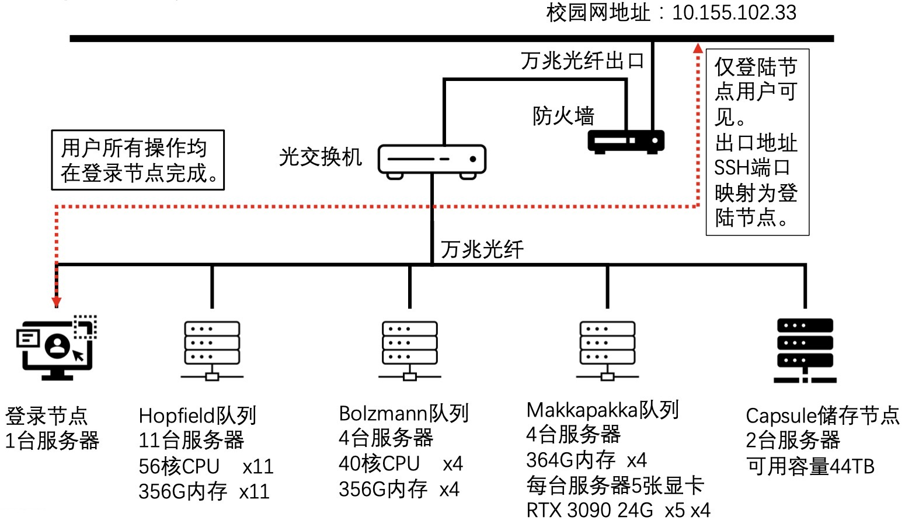
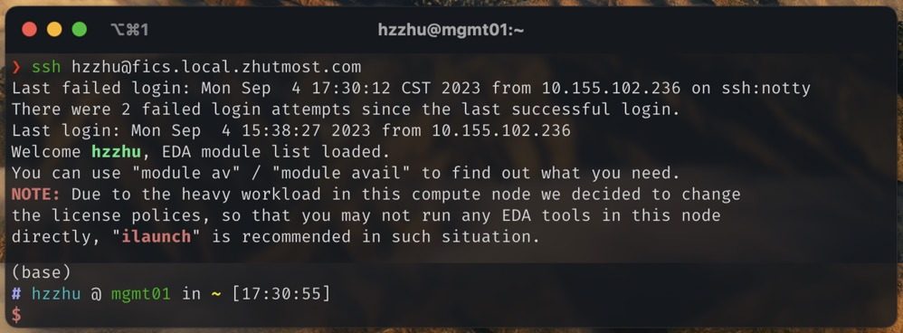
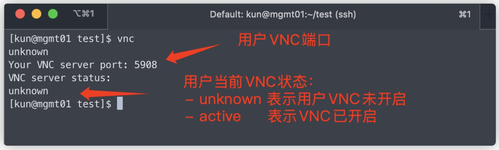

# FICS 服务器集群使用指南

> 文档维护：Haozhe Zhu（朱浩哲）

## FICS 总体情况介绍

FICS 服务器集群（FICS Is Computing Service, 下称 FICS）是芯片院的 EDA 与 AI 计算集群，包括若干计算队列：
- Hopfield - CPU 计算队列，用于 EDA 计算
- Boltzmann - CPU 计算队列，用于 EDA 计算
- Makkapakka - CPU/GPU 计算队列，用于 AI/GPU 计算
- Miller - A100 华大九天专用计算服务器，测试阶段暂不开放

FICS 的主要架构如下图所示：



用户所有的操作都在登陆节点 `cloud-mgmt01` 上进行，计算任务需要用户手动提交到计算节点上进行。

请在使用 FICS 之前务必确认并理解：
- 妥善保管好您的账号、密码、VNC 密码！
- 用户不允许在 FICS 上从事游戏、挖矿等任何盈利性或其他与芯片院科研学习无关的工作；
- 用户不允许未经指导老师和管理员同意，将 FICS 上的任何文件分享到芯片院之外；
- 用户应当及时备份自己的文件和数据，FICS 尽可能保护您的数据安全，但无法做任何承诺；
- 提问之前请先阅读本文档和谷歌搜索，几乎所有问题都可以找到答案。对于 CSDN、知乎等中文社区的回答，您应当保持怀疑态度，尽量不要参考。

请大家珍惜 FICS 计算资源，谨慎操作，避免影响到您和其他师生的使用。

## 用户文档

### 账号管理

FICS 部署了专门的邮件系统，用于用户账号管理。您可以通过向系统发送邮件完成账号申请、密码重置等操作。绝大多数操作都是自动化的，您无需等待管理员的回复。

系统邮箱：`techcrew AT fics.top`（请将`AT`替换成`@`），请严格按照下列操作说明发送邮件。请不要通过这个邮箱联系管理员，如需邮件联系管理员请阅读[文末的管理说明](#邮件联系管理员)。

注意事项:
1. 发送邮件前请确保邮箱可以正常收发邮件；
2. 不要频繁发送邮件到系统中，系统处理邮件需要一定的时间，所以请耐心等待；
3. 收到系统自动回复时间一般不超过 5 分钟（网络波动除外）；
4. 若超过 5 分钟收不到系统回复邮件可以先查看垃圾邮箱。

#### 账号申请

请使用您的**学号/工号邮箱**进行下列操作（申请完成后您的账号会和您申请所用邮箱绑定）：

1. 发送以 `adduser xxxx` 为标题的邮件到上述系统邮箱 (邮件标题前后没有空格，`xxxx` 为所需要申请到用户名，邮件内容任意)；
2. 系统收到邮件后会在 3 分钟之内自动回复标题为“FICS: adduser wait for ack”的邮件，并等待管理员通过创建；
3. 管理员会审核您的账号申请，无论通过与否，您都会收到一封说明邮件。

请注意：
- **如果您是芯片院的学生，请使用学号邮箱申请，且在发送邮件时必须抄送（`cc`）您的的日常指导老师，否则管理员不会受理**；
- 由于 FICS 的用户日见增多，我们不再接受个性化的用户名（管理员需要对应到现实中的人），请参考以下几种例子选择用户名（例如我叫“朱浩哲”）：
  ```
  名前姓后拼音全拼：haozhezhu 或 haozhe_zhu
  姓前名后拼音全拼：zhuhaozhe
  名前姓后且名使用拼音首字母：hzzhu（不推荐）
  // 大家可能觉得这个吹毛求疵的规定毫无意义，但我需要用这种方法简单地确保每个人都认真阅读了此文档。
  ```

#### 密码重置

使用申请账号时所使用的邮箱：
1. 发送以 `resetpassword xxxx` 为标题的邮件到上述系统邮箱（邮件标题前后没有空格，`xxxx` 为需要重置密码的用户名，邮件内容任意）；
2. 系统收到邮件后会在 3 分钟之内处理请求并重置邮件对应账号的密码，并自动回复带有新密码的邮件（系统会检查重置的账号和邮箱的关联性，只有账号关联邮箱才会执行重置密码操作，无关联邮件会被无视）。

**注意**： 重置密码后，账号缓存同步需要时间，因此收到密码重置邮件后请**不要立即**使用新密码登陆（此时新密码尚未生效，建议等待1～2分钟，缓存同步后会生效），避免触发错误密码锁账号的安全机制。

#### 获取 FICS 文档

鉴于您正在阅读本文档，您可以无视这一功能。

如果您需要旧版的文档，可使用申请账号时所使用的邮箱：
1. 发送以 `documentations` 为标题的邮件到上述系统邮箱（邮件标题前后没有空格，邮件内容任意）。
2. 系统收到邮件后会在 3 分钟之内处理请求并回复您。

#### 更改默认 Shell
使用申请账号时所使用的邮箱：

使用申请账号时所使用的邮箱：
1. 发送以 `chsh xxxx` 为标题的邮件到上述系统邮箱（邮件标题前后没有空格，`xxxx` 为需要设置的shell名字，如`zsh`、`bash`等，邮件内容任意）;
2. 系统收到邮件后会在 3 分钟之内自动处理请求，请您重新登录您的账号。

`bash` 是您申请账号时的默认 Shell，`zsh` 比它功能更丰富（搭配 Oh-My-Zsh 等）但速度更慢。

### 基本使用

#### 如何登录 FICS

FICS 的登陆节点是 `mgmt01`，您可以通过 SSH 登陆到该节点上，您可以使用任何支持 SSH 的终端工具：
- Terminal （Linux/macOS）
- PowerShell（Windows，自带）
- Putty（Windows，需另行安装，不推荐）

如果您目前处在校园网内，您可以直接使用 `ssh` 命令登陆：
```bash
ssh username@10.155.102.33
# 也可以使用下面这个（如果不想背出 IP 地址的话）
ssh username@fics.local.zhutmost.com
```
其中 `username` 是您的用户名。

如果您目前处在非校园网环境，您可以采取以下两种方式之一：
1. 使用学校 VPN、肉身进校等手段进入学校校园网环境，然后按照上面的方式登陆；
2. 在校外环境可以 SSH 连接反向代理域名 `****.com`（请联系管理员获取）：
   ```bash
   ssh username@****.com
   ```
   由于反向代理的域名登录网络有带宽限制，在校内网环境下，不推荐使用这一方法。

如果您成功登录，您会看到类似这样的界面：

请注意登录过程中需要您输入您的密码（在您申请账号成功的系统自动回复邮件中），第一次登录可能还会要求您确认证书（输入`yes`即可）。

**注意**：短时间多次错误密码登陆会导致账号被锁（这是一种安全机制，防止账号密码被定向爆破），解锁请邮件管理员。


#### 如何用 VNC 连接远程桌面虚拟节点

针对模拟电路设计、数字后端、观察仿真波形等需求，FICS 支持使用 VNC 访问远程桌面。如果您的工作仅限于 GPU 炼丹等没有图形界面需求的任务，您可以跳过这一节。

FICS 集群给每个用户分配了一台带有 VNC 的远程桌面虚拟节点，您需要使用 `knob` 命令启动和管理它。`knob` 的使用方法如下：

- `knob start`，如果您之前未使用过 VNC 远程桌面，需要使用该命令启动它；
- `knob status`，查看当前 VNC 远程桌面的状态；
- `knob reset`，重置您的 VNC 远程桌面的虚拟节点，并更新节点至最新版本的镜像；
- `knob restart`，重启当前 VNC 远程桌面；
- `knob shutdown`，关闭当前 VNC 远程桌面；

在 `knob start` 启动 VNC 远程桌面后，您可以通过 `knob status` 观察到您的 VNC 远程桌面已经启动，如下图所示。



该虚拟节点的主机名是 `cloud-USERNAME`，您的 VNC 会运行在该节点的 5901 端口。为了在您的计算机上访问该虚拟节点，您还需要先通过 SSH 进行端口转发，将这个端口映射到您本地的某个端口。您只需要在 SSH 登录时附带上 `-L 本地端口:cloud-USERNAME:5901` 参数即可，比如：
```bash
ssh username@fics.local.zhutmost.com -L 60000:cloud-USERNAME:5901
# 60000是您的本地的端口，10000-65535之间可以随便选（不要和自己电脑上其他服务冲突就行）
# 5901是您的 VNC 端口，cloud-USERNAME是你的虚拟节点主机名
```
只要您的 SSH 连接不断开，您就可以利用 VNC 客户端连接 `localhost:60000` 来访问您的远程桌面了。VNC 客户端有很多，您可以自行选择：
- RealVNC VNC Viewer（Windows/Linux/macOS，需另行安装，[官网下载](https://www.realvnc.com/en/connect/download/viewer)）；
- Remmina（Ubuntu 等部分 Linux 发行版自带）；
- macOS 自带（Finder文件管理器窗口下按下 `Cmd`+`K`，然后输入 `vnc://localhost:60000`）。

**注意**：
- 初次使用 VNC，请使用 `vncpasswd` 设置 VNC 密码（为了服务器安全，请勿使用 `123456`、`asdfghjkl` 等弱口令）。
- 请注意在 VNC 使用中，上述 SSH 连接不能断开（不要关闭 Terminal 或 PowerShell 窗口）。
- 管理员会经常更新虚拟节点的镜像，如果您发现了任何软件问题，可以考虑在 `cloud-mgmt01` 节点运行 `knob reset` 以升级您的镜像。一般情况下，这可以解决大多数已知的常见问题。
- VNC 桌面分辨率的设置和本地的 Linux 桌面设置方法一致，您可以在 VNC 桌面左上角的“所有应用程序-设置-显示”里找到。
- 关于 VSCode 直连 VNC 远程桌面，请查看[SSH 跳板连接的设置](#ssh-跳板连接的设置)。

#### FICS 的文件存储

尽管用户仅在登录节点 `mgmt01` 上操作，但对于计算节点来说，但是由于用户提交的任务需要计算节点读取相应的文件，因此以下目录都是所有节点可见的：

| 文件夹 | 位置 | 备注 |
|:-------|:-----|:-----|
| 用户 `HOME` 目录          | `/capsule/home/USERNAME`  |  |
| EDA 目录                  | `/capsule-ng/eda`         | 分布式存储 |
| PDK 目录                  | `/capsule/pdk`            |  |
| 其他软件目录              | `/capsule/opt`            |  |
| 分布式通用存储目录        | `/lamport/shared`         | 分布式存储 |
| 分布式 GPU 队列存储目录   | `/lamport/makkapakka`     | 分布式存储，仅 GPU 队列 `makkapakka` 可见 |

其中，
- `/capsule` 目录（包括 HOME 目录和 PDK 等）是存储在 Capsule 储存节点服务器上的，文件 I/O 服务质量可能受该服务器的负载情况影响；
- `/lamport` 目录和 `/lamport/shared` 目录均是分布式存储，不受单个节点影响，有较高的 I/O 带宽（但对于大量小文件的情形会不太友好）；
- `/lamport/makkapakka` 和 `/lamport/shared` 类似，但它仅对 GPU 队列 `makkapakka` 可见；
- 我们为绝大多数共享目录都设置了内存缓存，以改善 I/O 性能。

因此，我们建议您尽可能将 EDA/AI 任务的大规模文件 I/O （例如 AI 数据集、仿真波形等）放在 `/lamport/shared`  或 `/lamport/makkapakka` 目录下，以获得更好的综合 I/O 性能。如果需要使用的话，您可以在对应的 `/lamport/shared`  或 `/lamport/makkapakka` 目录下创建一个和您的用户名完全一致的文件夹，把您的个人数据放在其中。

此外，任何情况下都不要在您的 `HOME` 目录下进行大规模文件 I/O（比如执行一些 Python 批处理脚本），会导致所有人都会变卡顿。

#### FICS 和本地间的文件上传/下载

FICS 提供了 SFTP 协议供用户访问，因此用户可以使用基于 SSH 的 SCP 命令或工具进行文件的上传和下载。由于 SCP 是基于 SSH 协议的，因此这里如果需要填写密码，请填写您的 FICS 账户密码（而不是 VNC 密码）。

**注意**：默认情况下，普通用户没有开通SFTP权限，因此您无法上传、下载服务器上的文件。如果您需要开通该权限，请您联系管理员申请（如果您是 FICS 的学生，请先征得日常指导老师的同意）。

Linux 和 macOS 预置了 `scp` 命令，您可以在 Terminal 中使用该命令。您可以参考以下的例子：
```bash
# 上传本地的 a.txt 文件到服务器上的 /capsule/home/USERNAME/Desktop 目录下
scp ./a.txt f USERNAME@fics.local.zhutmost.com:/capsule/home/USERNAME/Desktop/a.txt
# 下载服务器上的 /capsule/home/USERNAME/Desktop/b.txt 文件到本地的 ~/Downloads 目录下
scp USERNAME@fics.local.zhutmost.com:/capsule/home/USERNAME/Desktop/b.txt ~/Downloads/b.txt
# 上传或下载文件夹则需要加上 -r 参数
 scp -r USERNAME@fics.local.zhutmost.com:/capsule/home/USERNAME/Workspace/proj_0  ~/Workspace/proj_0
```

对于 Windows 用户，我们推荐使用 [WinSCP](https://winscp.net/eng/download.php) 工具。

您也可以使用其他 SFTP 软件客户端访问服务器。

### 任务的提交与管理

FICS 采用 SLURM 调度器进行计算任务到节点的分发。您可以阅读[官方文档](https://slurm.schedmd.com/documentation.html)获取完整的 SLURM 使用方法。

这里仅列出一些常用的命令供参考：
- `sinfo` - 查看集群节点状态（应该能看到 `hopfield`/`boltzmann`/`makkapakka` 三组队列）；
- `squeue` - 查看当前队列中的任务；
  ```bash
  squeue -u hzzhu # 查看 hzzhu 用户的任务
  squeue -p boltzmann # 查看 Boltzmann 队列上正在进行的任务
  ```
- `scancel` - 取消已提交的任务；
  ```bash
  scancel JOB_ID # 取消 JOB_ID 对应的任务，JOB_ID 可以通过 squeue 查看
  ```
- `srun` - 提交交互式任务（不太熟悉 SLURM 的用户可以考虑使用 `ilaunch`/`zlaunch` 代替）；
- `sbatch` - 提交批处理任务；

考虑到不少 FICS 用户对于 Linux 的了解比较有限，我们对 `srun` 进行了简化的包装，帮助您更加简便地提交带图形界面的 EDA/AI 任务：
- `ilaunch` - 我们已经在 `PATH` 中添加了 `ilaunch` 命令，您可以直接使用它来提交任务。[使用文档还在施工](./ilaunch.md)，暂时可以参考：
  - `ilaunch virtuoso` - 将 EDA 软件分配到集群中去运行
  - `ilaunch load ic/618 virtuoso` - 可实现加载特别版本的 EDA 软件
  - `ilaunch q makkapakka python` - 参数 `q` 可以切换不同的计算队列，默认为 Hopfield
  - `ilaunch list` - 可以打印当前已加载 EDA 列表
- `zlaunch` - 与 `ilaunch` 类似，它是由 [Haozhe Zhu](https://github.com/zhutmost) 个人维护的。[使用文档](https://github.com/cihlab/zlaunch)

注意，您不应该（也应当无法）SSH 到计算节点服务器上运行程序，所有的任务都应该通过 SLURM 调度器提交到计算节点上执行。

### EDA 软件环境设置

我们设置了一套开箱即用的 EDA 环境，无需配置。默认加载的 EDA 软件及其版本如下：

<details>
<summary> 点击展开显示 </summary>

```
// ansys
EM/21.1             powerartist/2021R2.2
// comsol
multiphysics/5.5
// xpeedic
metis/2023.01       snpexpert/2022.01
// xilinx
vivado/2020
// mathworks
matlab/2020b
// keysight
ads/2021u2
// mentor
calibre/2020.3      modelsim/10.4c      powerpro/10.3c      tessent/2020.3
// synopsys
txs/2019.03         coretools/2017.06   nicc/2019.03        powerep/2020.03     hspice/2019.06      fusioncompiler/2019.12
icv/2019.12         spyglass/2019.06    xa/2018.09          ppwr/2019.03        syn/2019.03         siliconsmart/2019.06
verdi/2020.03       vc_static/2020.03   finesim/2020.03     prime/2019.03       sentaurus/2019.03   wv/2019.06
icc2/2019.12        lc/2019.03          starrc/2019.03      vcs/2020.03         fm/2019.12
// cadence
genus/20.1          jasper/2020.09      ssv/17.1            confrml/20.22       innovus/19.1        peakview/5.1
skillpro/4.2F       emx/5.6             liberate/18.1       xcelium/17.1        ic/618              qrc/16.1
spectre/19.1
// systools
htop/2.2.0          python/3.9
```
</details>

如果您觉得已默认加载的软件的版本可以接受，可以忽略本节下面的内容。

FICS 采用 `module` 管理 EDA 软件环境。您可以阅读[官方文档](https://modules.readthedocs.io/en/latest)获取完整的 `module` 使用方法。

这里仅列出一些常用的命令供参考：
- `module avail` - 检查当前可用的 EDA 软件（`<L>` 后缀表示已加载，`(default)`后缀表示默认）；
- `module load syn/2019.03` - 加载指定的 EDA 软件（这里以 `syn/2019.03` 为例）；
- `module list` - 列出已加载的全部 EDA 软件；
- `module purge` - 卸载所有已加载的 EDA 软件。
- `module unload syn/2019.03` - 卸载指定的 EDA 软件（这里以 `syn/2019.03` 为例），一般不需要使用该命令；

您可以通过 `module avail` 查看当前可用的 EDA 软件，通过 `module load` 加载相应的软件环境，比如：

> FICS 管理员无法处理 EDA 软件的使用问题，请您自行阅读 EDA 软件自带的文档；
>
> 如果您需要 Synopsys EDA 全家桶的文档，您可以前往 [Haozhe Zhu](https://github.com/zhutmost) 的 [NAS 服务器](https://github.com/cihlab/survive-guide/blob/main/qnap-nas/README.md)获取。

**注意**：`ilaunch` 在提交任务时，会使用默认的 EDA 环境（不会自动加载您已经 `module load` 的 EDA 软件），您可以参考 `ilaunch` 的文档。

### GPU 炼丹相关

请参考[文档](./gpu-queue.md)。

### SSH 跳板连接的设置

开启 VNC 远程桌面（`knob start`）后，可以使用跳板命令直接连接虚拟节点，从而直接传输文件或者连接 VSCode 等 IDE。即使用以下命令：
```bash
ssh -J USERNAME@10.155.102.33 USERNAME@cloud-USERNAME
```

为了方便使用，我们还可以设置 SSH 的配置文件（在 Linux/macOS 上是 `~/.ssh/config`）达到简化命令的目的。

```
Host fics.local
  HostName 10.155.102.33
  User USERNAME
  IdentityFile YOUR_FILE

Host fics-knob.local
  HostName cloud-USERNAME
  User USERNAME
  ProxyJump fics
```

这样直接使用命令`ssh fics-knob.local`即可连接至虚拟节点。在VSCode中，连接至远程服务器也会弹出对应选项。

### 跨账户文件共享与权限管理

FICS 基于 Linux 的权限管理机制，您可以通过 `chmod` 命令修改文件的权限，通过 `chown` 命令修改文件的所有者。这方面的文档和参考资料很多，您可以自行谷歌搜索。

在您的账户被创建时，FICS 会自动创建一个和您的用户名完全一致的用户组，您可以通过 `groups` 命令查看您所属的用户组。
您可以使用 `kgroup` 命令管理这一用户组，从而实现文件共享：
```bash
# 查看用户组的成员
kgroup -s
# 将 USERNAME 添加到用户组
kgroup -a USERNAME
# 从用户组中删除 USERNAME
kgroup -d USERNAME
# 查看 kgroup 的帮助信息
kgroup --help
```

举个例子，如果您希望将某个文件夹共享给用户张三（`sanzhang`）同时不共享给李四（`sili`），您可以先使用 `chmod` 命令修改文件夹的权限为750（即用户组用户可以访问但其他用户不可访问），然后将 `sanzhang` 加入您的用户组。
```bash
chmod 750 /path/to/your/folder
kgroup -a sanzhang
```

由于 FICS 采用了分布式的文件系统，您在每次修改权限后需要等待服务器间的同步，您也可以在 Shell 中执行 `flushsss` 命令来手工执行同步机制。
如果其他用户仍然无法访问您的文件夹和文件，请提醒他们重启自己的 SSH 链接（VNC 用户需要 `vnc restart`）。

## TroubleShooting

1. 不要惊慌，先reset knob；
2. 检查自己的操作步骤是否正确，重新操作一遍看是否复现问题，**并且在操作的过程中记录下操作步骤以及操作的结果**；
3. 若问题成功复现，将步骤2中记录下的**用户名、操作步骤、操作结果、预期结果**（**缺一不可**）整理好，任选一种方式提出问题：
   a. 询问周围有经验同学
   b. 邮件
   c. github issue
   d. 管理群

## FICS 的管理

绝大多数您的问题都可以通过阅读用户文档解决。
如果您在使用 FICS 的过程中遇到了难以解决的问题，除了在办公室内询问其他人，您也可以通过以下方式与管理员或其他用户交流。

### GitHub Issue（建议）

直接在 GitHub 上[创建 Issue](https://github.com/cihlab/fics-cluster-guide/issues)，并清楚描述您遇到的问题或现象。

建议您先阅读其他已经创建的 Issue，看看有没有类似的问题。

### 微信协调群

如果您需要与其他用户或管理员交流讨论关于 FICS 使用的任何问题，都可以加入微信群。因为微信群的二维码会过期，所以这里就不附二维码了。

您可以询问其他人邀请您加入微信群。绝大多数电路设计方向的老师都已经在群里了，您可以考虑询问他们。

### 邮件联系管理员

FICS 目前由 [Kun Hu](https://github.com/llfl) 维护，[Haozhe Zhu](https://github.com/zhutmost) 协助。联系方式如下：
- Kun Hu（胡坤）：`i AT imux.top`（复旦邮箱可能会收不到部分 `.top` 结尾的邮件，这是学校的问题，我们解决不了 T.T ）
- Haozhe Zhu（朱浩哲）：`zhuhz AT fudan.edu.cn`

请务必将上面所有管理员邮箱都列为收件人；如果您是芯片院的学生，请务必同时邮件抄送（`cc`）给您的日常指导老师。

由于管理员都是兼职的，可能无法及时回复，请谅解。
