# 在Windows上使用pycharm 2021.3在服务器远程调试（包括运行代码与debug）。

## 运行代码
本例子中使用的是pycharm 2021.3（windows上安装），python版本是3.6.2（已经在服务器个人账户下安装好）
本步参考链接为：（部分步骤参考）
[链接1：如何使用Pycharm进行远程开发，并实现在家远程与公司服务器资源同步](https://blog.csdn.net/qq_63320529/article/details/134998835)
在本地windows建立python工程。
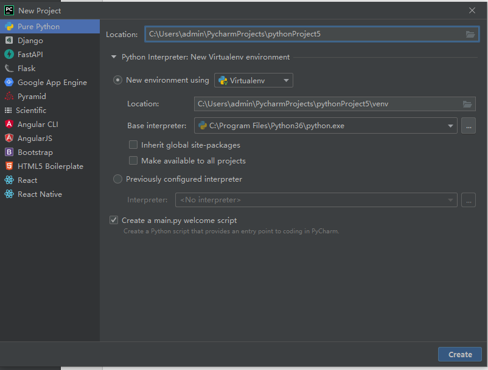
待工程建立好以后需要调整interpreter与path mapping。
调整interpreter的菜单位置是：
File->settings...->Project:your_pj_name->Python interpreter
打开界面如下：
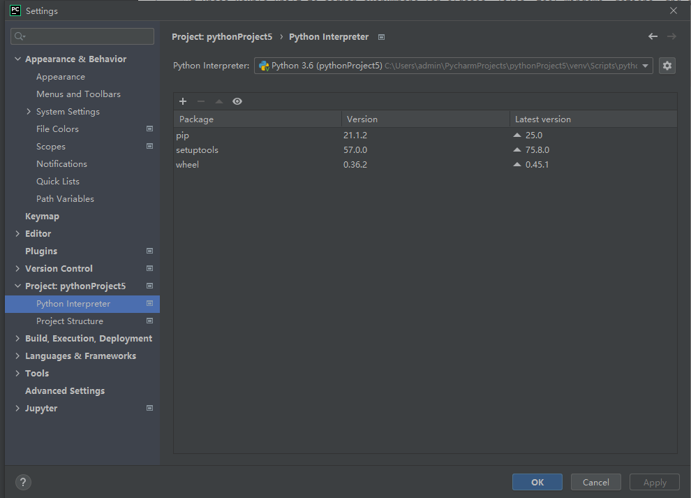
然后点击齿轮，点击"Add..."
打开配置ssh interpreter信息页面：
Host后填写服务器ip地址：10.155.102.33；
Username后填写服务器用户名；
Port可以不用改。
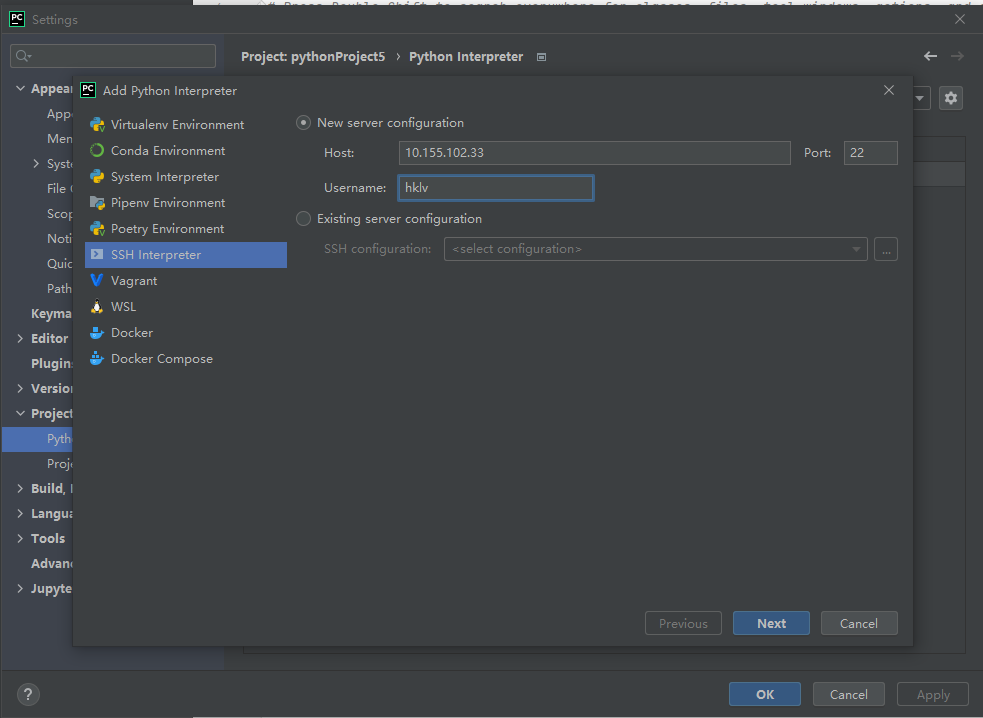
然后寻找服务器中interprete的位置并设置好path mapping的位置：
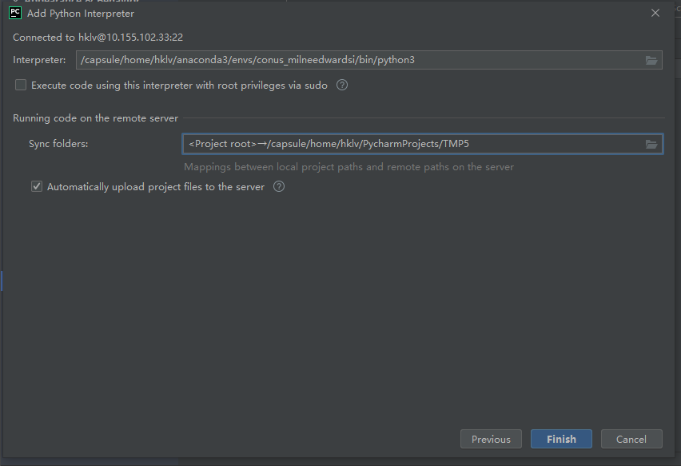
如果path mapping这步忘设置了，调整path mapping路径的菜单位置是：
Tools->Deployment->Configuration->Mappings
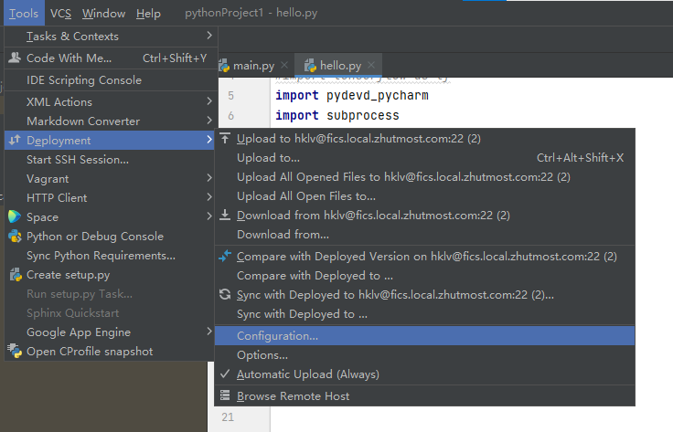
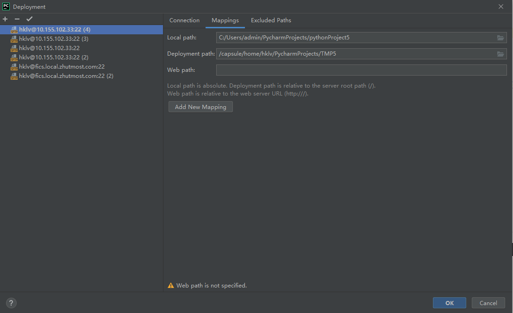
测试代码如下：
main.py

```python 
import os

os.system('srun -p makkapakka  python ./hello.py')
```
hello.py

```python 
import subprocess
import platform


def get_gpu_info():
    process = subprocess.Popen(
        ['nvidia-smi'],
        stdout=subprocess.PIPE,
        stderr=subprocess.PIPE,
        universal_newlines=True
    )
    stdout, stderr = process.communicate()
    if process.returncode == 0:
        print("gpu info:")
        print(stdout)


get_gpu_info()
print("ps:", platform.system())
print("version:", platform.release())
a = 1
print(a)
print('hello!!!!')
```
输出如下：（注意第一行编译器路径以及编译代码路径均在服务器中，否则无法工作）
```
ssh://hklv@10.155.102.33:22/capsule/home/hklv/anaconda3/envs/conus_milneedwardsi/bin/python3 -u /capsule/home/hklv/PycharmProjects/TMP5/main.py
gpu info:
Thu Jan 30 21:14:16 2025       
+---------------------------------------------------------------------------------------+
| NVIDIA-SMI 535.98                 Driver Version: 535.98       CUDA Version: 12.2     |
|-----------------------------------------+----------------------+----------------------+
| GPU  Name                 Persistence-M | Bus-Id        Disp.A | Volatile Uncorr. ECC |
| Fan  Temp   Perf          Pwr:Usage/Cap |         Memory-Usage | GPU-Util  Compute M. |
|                                         |                      |               MIG M. |
|=========================================+======================+======================|
|   0  NVIDIA GeForce RTX 3090        Off | 00000000:36:00.0 Off |                  N/A |
| 30%   14C    P8              24W / 350W |      2MiB / 24576MiB |      0%      Default |
|                                         |                      |                  N/A |
+-----------------------------------------+----------------------+----------------------+
|   1  NVIDIA GeForce RTX 3090        Off | 00000000:3D:00.0 Off |                  N/A |
| 30%   14C    P8              30W / 350W |      2MiB / 24576MiB |      0%      Default |
|                                         |                      |                  N/A |
+-----------------------------------------+----------------------+----------------------+
|   2  NVIDIA GeForce RTX 3090        Off | 00000000:CE:00.0 Off |                  N/A |
| 30%   13C    P8              21W / 350W |      2MiB / 24576MiB |      0%      Default |
|                                         |                      |                  N/A |
+-----------------------------------------+----------------------+----------------------+
|   3  NVIDIA GeForce RTX 3090        Off | 00000000:D2:00.0 Off |                  N/A |
| 30%   14C    P8              29W / 350W |      2MiB / 24576MiB |      0%      Default |
|                                         |                      |                  N/A |
+-----------------------------------------+----------------------+----------------------+
|   4  NVIDIA GeForce RTX 3090        Off | 00000000:D6:00.0 Off |                  N/A |
| 30%   15C    P8              26W / 350W |      2MiB / 24576MiB |      0%      Default |
|                                         |                      |                  N/A |
+-----------------------------------------+----------------------+----------------------+
                                                                                         
+---------------------------------------------------------------------------------------+
| Processes:                                                                            |
|  GPU   GI   CI        PID   Type   Process name                            GPU Memory |
|        ID   ID                                                             Usage      |
|=======================================================================================|
|  No running processes found                                                           |
+---------------------------------------------------------------------------------------+

('ps:', 'Linux')
('version:', '3.10.0-1160.el7.x86_64')
1
hello!!!!

Process finished with exit code 0
```


## 利用服务器远程debug
此办法是Kun博想出，我这边跑通后以文档形式分享。 
原帖地址：[github issue #40](https://github.com/cihlab/fics-cluster-guide/issues/40)
1. 首先配置pycharm debugger，设置好IDE host name，Port以及Path Mapping。
   这里配置Port是59002。
   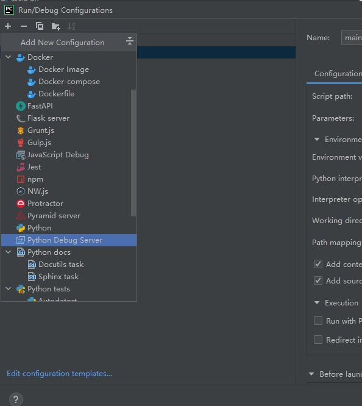
   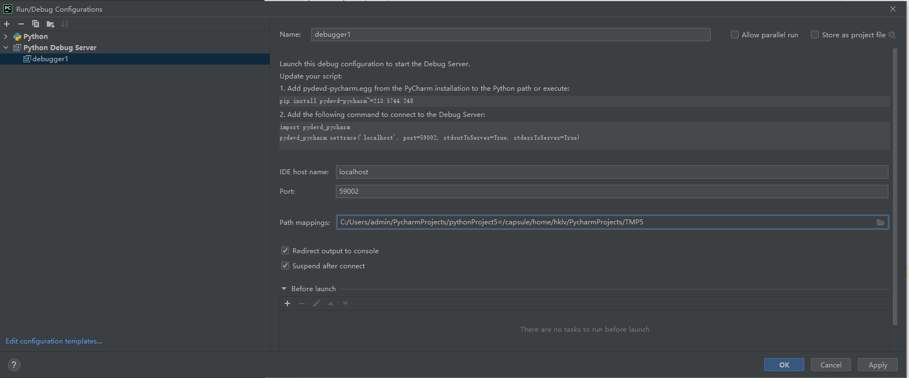

2. 配置ProxyJump到knob， ssh config文件内容如下：

``` 
Host remote-jump
        HostName server-to-mgmt01
        User your-user-name

Host knob-host
        Hostname knob-host-name
        User your-user-name
        ProxyJump remote-jump
```
windows环境下config路径如下：
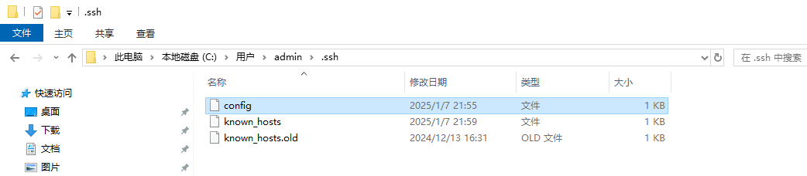

根据个人账号修改上方脚本，config内容如下：
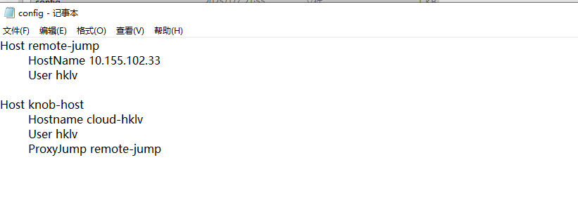

如果碰到报错public key的问题，可查阅此[说明文档](./ssh_publickey.md)。

3. 通过-R登陆到knob， 在pycharm terminal执行ssh -R 59002:localhost:59002 knob-host

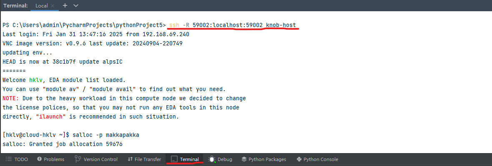

4. 用salloc -p makkapakka 申请队列，申请队列之后会产生一个interactve的slurm job，不要退出该终端，并且在上述alloc出来的终端中可以看到分配的slurm节点，比如makkapakka0X。

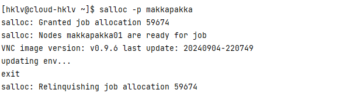

5. 然后通过ssh -R 59002:localhost:59002 makkapakka0X即可登陆到节点上

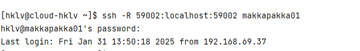

6. 启动debugger，然后再debug main，即可成功debug，单步调试程序。

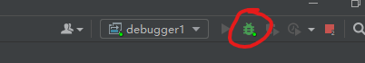

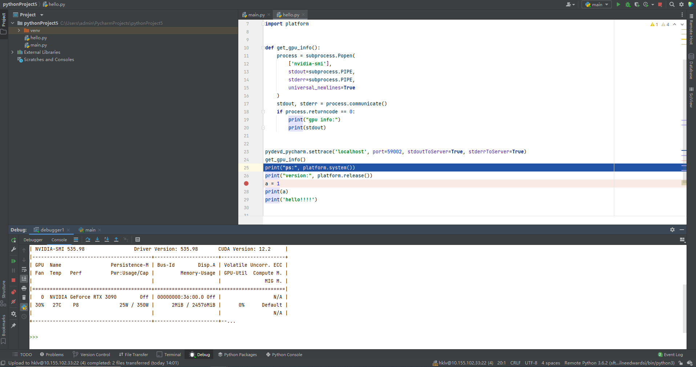