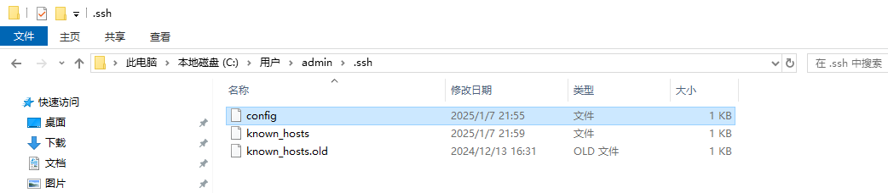
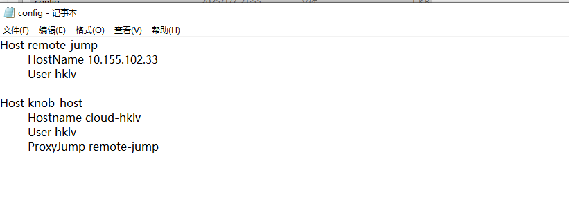

# Windows 无法使用 ssh config 文件配置命令登录服务器，报错 Permission denied (public key)。


## 报错背景
配置 ssh config 文件后，cmd 窗口输入文件中配置的 ssh 命令，报错Permission denied (public key)。

ssh config 文件位置如下：



config 文件配置如下：（此例中配置jump server）



报错信息1：（此时有StrictHostKeyChecking）


报错信息2：（此时无StrictHostKeyChecking）


## 解决办法
参考了两个帖子，链接如下：

[链接1：SSH生成SSH密钥（公钥和私钥）](https://blog.csdn.net/qq_43420088/article/details/139775270)

[链接2：windows配置免密登录远程服务器，‘ssh-copy-id‘ 不是内部或外部命令，也不是可运行的程序或批处理文件。](https://blog.csdn.net/qq_45417579/article/details/132110216)


先按照链接1操作前两步：

1. 使用命令生成公钥和私钥 `ssh-keygen -t rsa -b 4096 -C "your_email@example.com"`

	-t rsa：指定密钥类型为RSA。

	-b 4096：指定密钥长度为4096位。

	-C “your_email@example.com”：添加注释（通常是您的电子邮件地址），这个邮箱填什么都行，我直接使用这个带example的邮箱没有改。

2. 确认文件夹下出现公钥和私钥文件：


操作到第三步时报错 windows 没有 ssh-copy-id 命令，于是需要参考链接2：

1.打开windows power shell，输入以下代码：（或直接去链接2拷贝）

```shell 
function ssh-copy-id([string]$userAtMachine, $args){   
	$publicKey = "$ENV:USERPROFILE" + "/.ssh/id_rsa.pub"
	if (!(Test-Path "$publicKey")){
		Write-Error "ERROR: failed to open ID file '$publicKey': No such file"            
	}
	else {
		& cat "$publicKey" | ssh $args $userAtMachine "umask 077; test -d .ssh || mkdir .ssh ; cat >> .ssh/authorized_keys || exit 1"      
	}
}
```


2.输入命令：`ssh-copy-id your_user_name@10.155.102.33`


拷贝公钥后，就可以跑通ssh config文件中配置的命令，顺便免密登录服务器。


